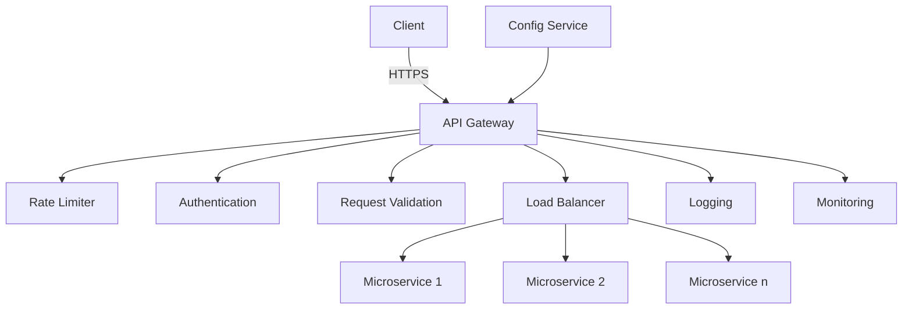

```mermaid
graph TD
    A[Client] -->|HTTPS| B[API Gateway]
    B --> C[Rate Limiter]
    B --> D[Authentication]
    B --> E[Request Validation]
    B --> F[Load Balancer]
    F --> G[Microservice 1]
    F --> H[Microservice 2]
    F --> I[Microservice n]
    B --> J[Logging]
    B --> K[Monitoring]
    L[Config Service] --> B
```