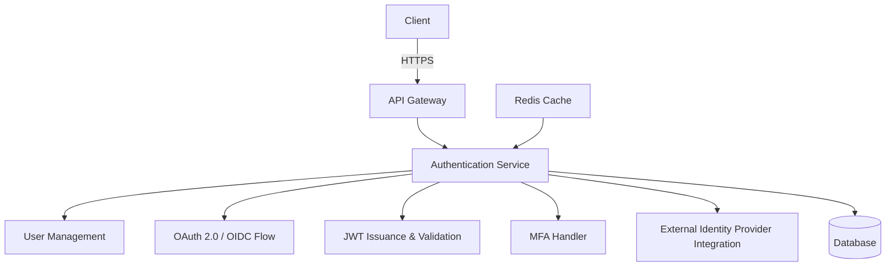

```mermaid
graph TD
    A[Client] -->|HTTPS| B[API Gateway]
    B --> C[Authentication Service]
    C --> D[User Management]
    C --> E[OAuth 2.0 / OIDC Flow]
    C --> F[JWT Issuance & Validation]
    C --> G[MFA Handler]
    C --> H[External Identity Provider Integration]
    C --> I[(Database)]
    J[Redis Cache] --> C
```