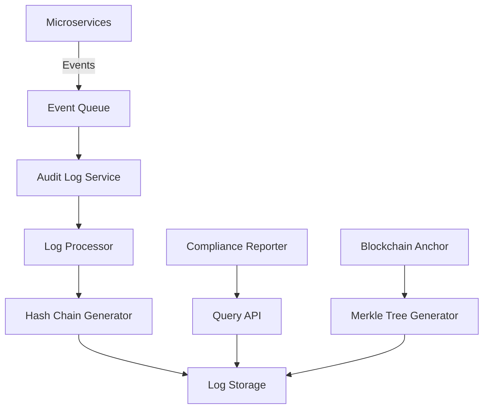

```mermaid
graph TD
    A[Microservices] -->|Events| B[Event Queue]
    B --> C[Audit Log Service]
    C --> D[Log Processor]
    D --> E[Hash Chain Generator]
    E --> F[Log Storage]
    G[Query API] --> F
    H[Compliance Reporter] --> G
    I[Merkle Tree Generator] --> F
    J[Blockchain Anchor] --> I
```