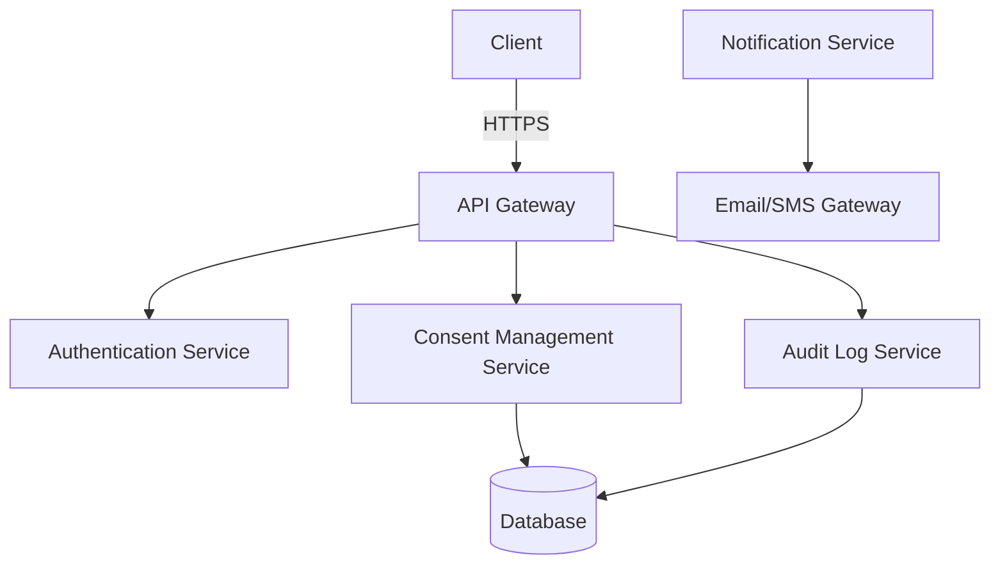

```mermaid
graph TD
    A[Client] -->|HTTPS| B[API Gateway]
    B --> C[Authentication Service]
    B --> D[Consent Management Service]
    B --> E[Audit Log Service]
    F[(Database)]
    D --> F
    E --> F
    G[Notification Service] --> H[Email/SMS Gateway]
```