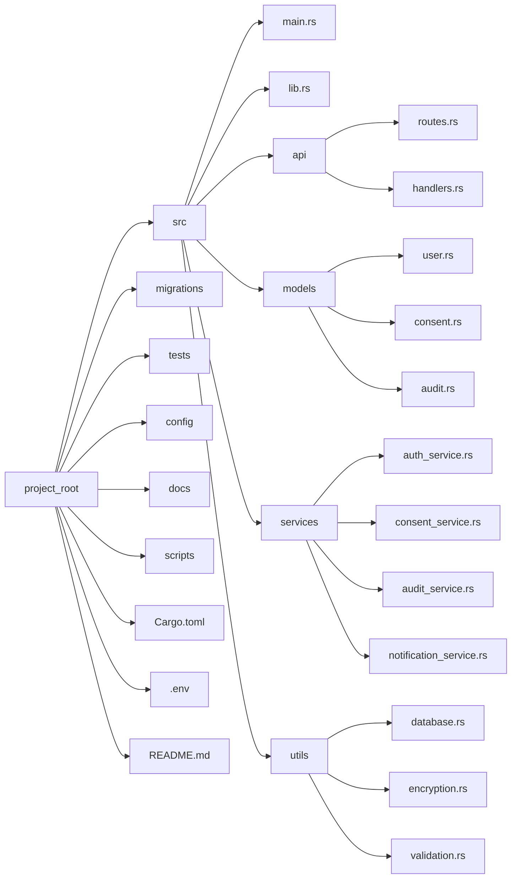

```mermaid
graph LR
    A[project_root] --> B[src]
    A --> C[migrations]
    A --> D[tests]
    A --> E[config]
    A --> F[docs]
    A --> G[scripts]
    B --> H[main.rs]
    B --> I[lib.rs]
    B --> J[api]
    B --> K[models]
    B --> L[services]
    B --> M[utils]
    J --> N[routes.rs]
    J --> O[handlers.rs]
    K --> P[user.rs]
    K --> Q[consent.rs]
    K --> R[audit.rs]
    L --> S[auth_service.rs]
    L --> T[consent_service.rs]
    L --> U[audit_service.rs]
    L --> V[notification_service.rs]
    M --> W[database.rs]
    M --> X[encryption.rs]
    M --> Y[validation.rs]
    A --> Z[Cargo.toml]
    A --> AA[.env]
    A --> AB[README.md]
```